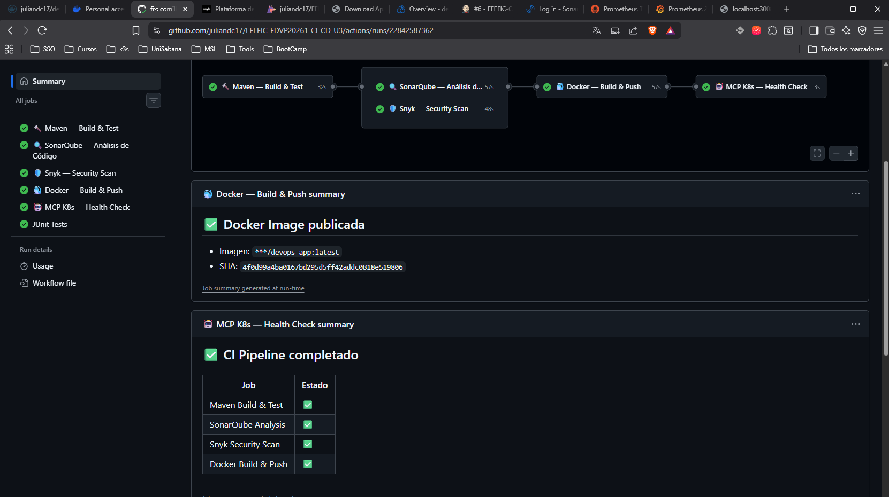
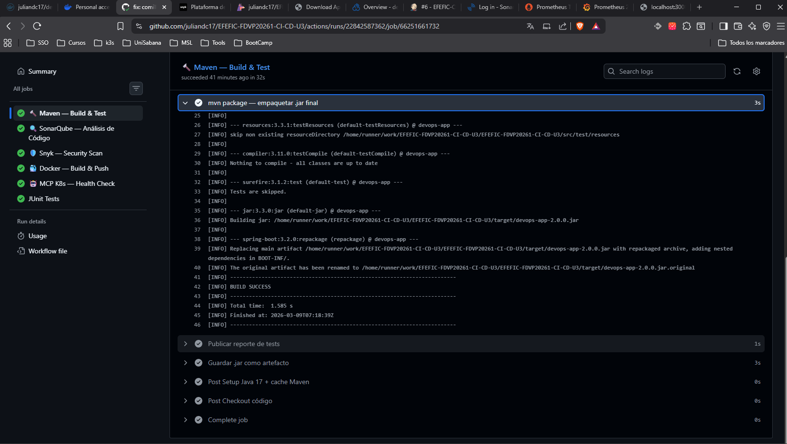
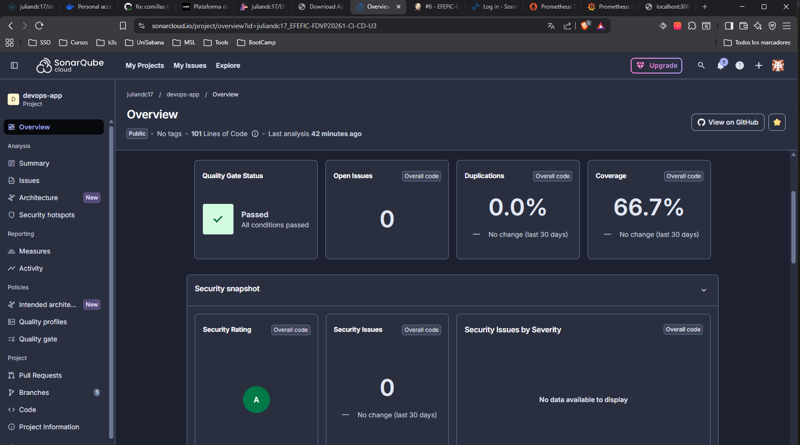
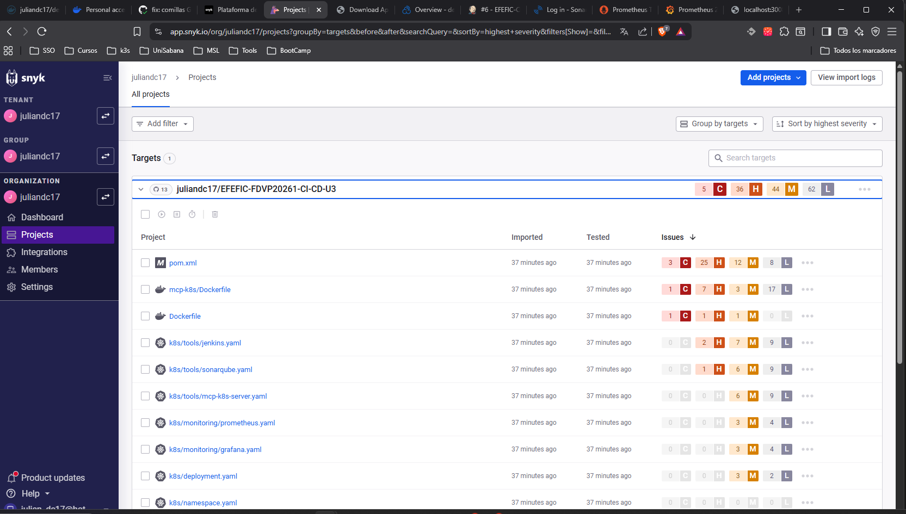
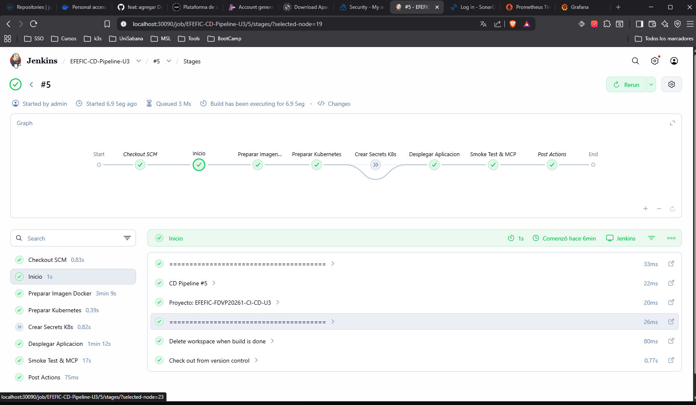
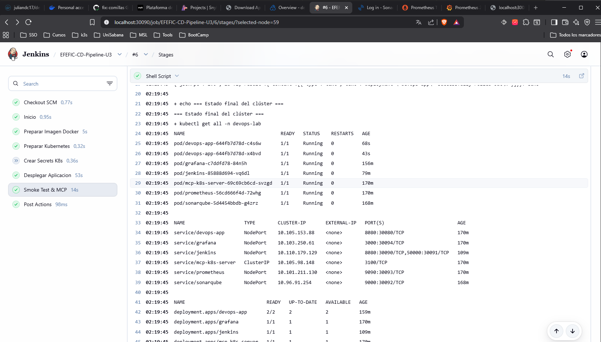
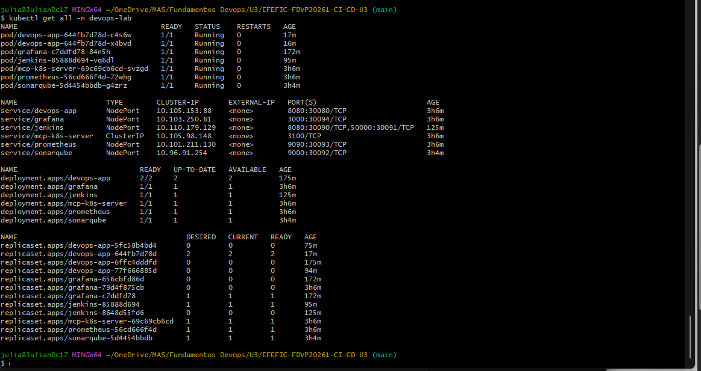
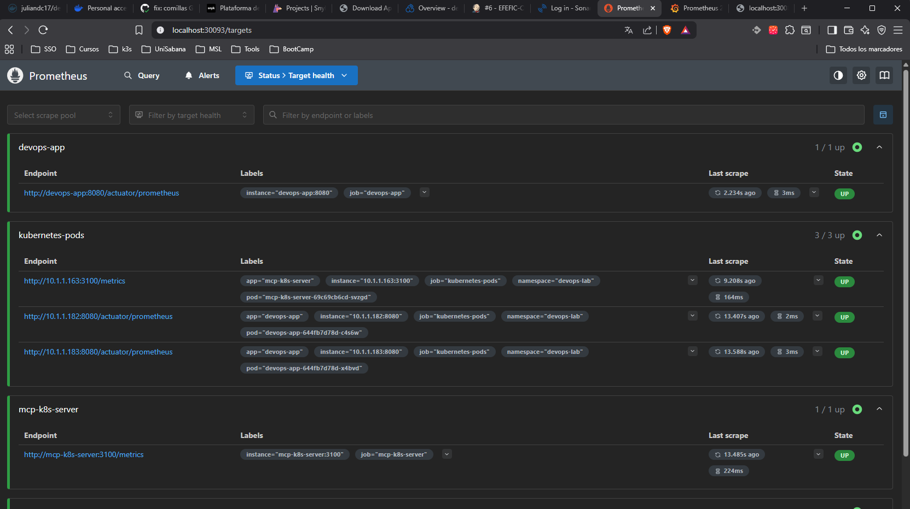
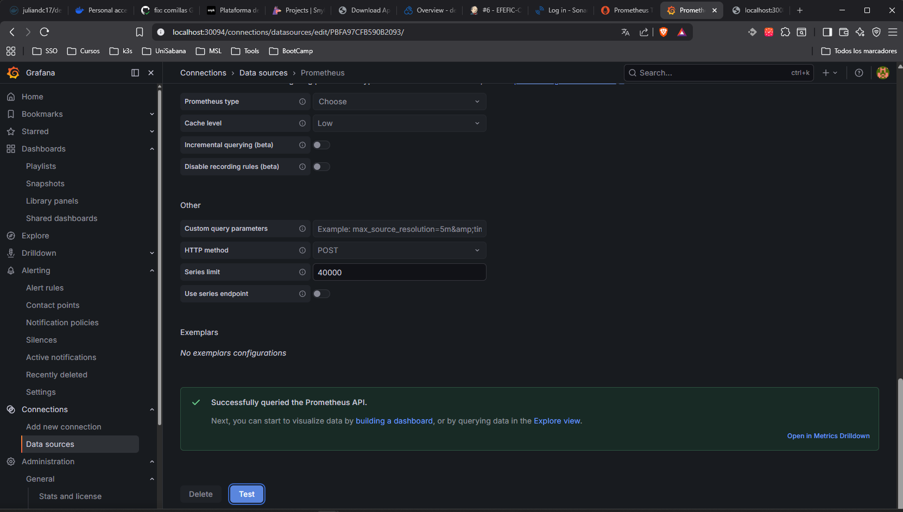
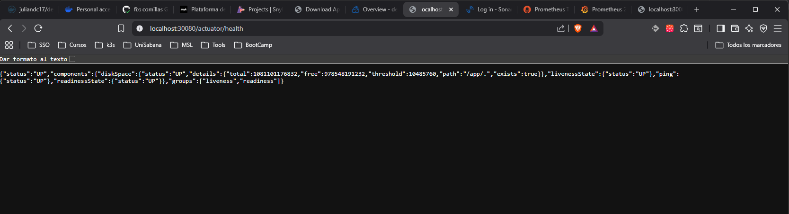

# EFEFIC-FDVP20261-CI-CD-U3


## Pipeline CI/CD Completo — Seguridad + Monitoreo + MCP Kubernetes

> **Segundo entregable — EFEFIC-FDVP20261 | Metodología ABP**
> Todo en Kubernetes (Docker Desktop). Sin Docker Compose.

---


## 🏗️ Arquitectura

```
GitHub Push (main/develop)
        │
        ▼
┌─────────────────────────────────────────────┐
│         GitHub Actions — CI Pipeline         │
│  Job 1: Maven Build + Test (JUnit + JaCoCo)  │
│  Job 2: SonarQube/SonarCloud Analysis        │
│  Job 3: Snyk — CVEs en dependencias          │
│  Job 4: Docker Build + Push → Docker Hub     │
│  Job 5: MCP K8s Health Check                 │
└──────────────────┬──────────────────────────┘
                   │ imagen lista en Docker Hub
                   ▼
┌─────────────────────────────────────────────┐
│          Jenkins — CD Pipeline               │
│  Stage 1: Checkout                           │
│  Stage 2: Verificar imagen Docker Hub        │
│  Stage 3: Preparar namespace K8s             │
│  Stage 4: Deploy tools (1ra vez)             │
│  Stage 5: Deploy aplicación (rolling update) │
│  Stage 6: MCP K8s — verificar deploy         │
│  Stage 7: Smoke Test                         │
└──────────────────┬──────────────────────────┘
                   │
                   ▼
┌─────────────────────────────────────────────────────┐
│      Kubernetes — namespace: devops-lab              │
│                                                      │
│  [devops-app x2]  → NodePort 30080                   │
│  [jenkins]        → NodePort 30090                   │
│  [sonarqube]      → NodePort 30092                   │
│  [prometheus]     → NodePort 30093                   │
│  [grafana]        → NodePort 30094                   │
│  [mcp-k8s-server] → ClusterIP :3100 (interno)        │
└─────────────────────────────────────────────────────┘
```

---

## 📁 Estructura del Repositorio

```
EFEFIC-FDVP20261-CI-CD-U3/
│
├── .github/
│   └── workflows/
│       └── ci.yml                        # CI — GitHub Actions (5 jobs)
│
├── jenkins/
│   └── Jenkinsfile                       # CD — Jenkins (7 stages)
│
├── k8s/
│   ├── namespace.yaml                    # Namespace: devops-lab
│   ├── configmap.yaml                    # Variables de entorno app
│   ├── deployment.yaml                   # App — 2 réplicas, rolling update
│   ├── service.yaml                      # NodePort :30080
│   ├── tools/
│   │   ├── jenkins.yaml                  # Jenkins + RBAC cluster-admin
│   │   ├── sonarqube.yaml                # SonarQube Community
│   │   └── mcp-k8s-server.yaml          # MCP Server + RBAC lector
│   └── monitoring/
│       ├── prometheus.yaml               # Prometheus + RBAC + ConfigMap scraping
│       └── grafana.yaml                  # Grafana + datasource + alertas
│
├── mcp-k8s/
│   ├── server.js                         # MCP Server Node.js (6 tools K8s)
│   ├── package.json
│   ├── Dockerfile
│   └── claude_desktop_config.example.json
│
├── security/
│   ├── sonar-project.properties          # Config SonarQube Scanner
│   └── .snyk                             # Política Snyk
│
├── src/
│   ├── main/java/com/devops/app/
│   │   ├── DevopsApplication.java        # Entry point Spring Boot
│   │   └── AppController.java            # REST endpoints /  /hello
│   ├── main/resources/
│   │   └── application.properties        # Config actuator + prometheus
│   └── test/java/com/devops/app/
│       └── AppControllerTest.java        # Tests unitarios JUnit 5
│
├── docs/
│   ├── technical-report.md               # Informe técnico completo
│   └── screenshots/                      # Capturas de evidencia (vacía — llenar)
│
├── Dockerfile                            # Multi-stage build Java app
├── pom.xml                               # Maven — Spring Boot + JaCoCo + Sonar
├── .gitignore
└── README.md
```

---

## 🚀 Despliegue Completo (Paso a Paso)

### Pre-requisitos
```bash
docker --version        # Docker Desktop instalado
kubectl get nodes       # docker-desktop Ready
java -version           # Java 17
mvn --version           # Maven 3.8+
```

### 1 — Clonar y configurar
```bash
git clone https://github.com/TU-USUARIO/EFEFIC-FDVP20261-CI-CD-U3.git
cd EFEFIC-FDVP20261-CI-CD-U3
# Editar k8s/deployment.yaml → cambiar TU-USUARIO por tu usuario Docker Hub
```

### 2 — Desplegar namespace
```bash
kubectl apply -f k8s/namespace.yaml
```

### 3 — Desplegar aplicación
```bash
kubectl apply -f k8s/configmap.yaml   -n devops-lab
kubectl apply -f k8s/deployment.yaml  -n devops-lab
kubectl apply -f k8s/service.yaml     -n devops-lab
```

### 4 — Desplegar herramientas
```bash
kubectl apply -f k8s/tools/jenkins.yaml          -n devops-lab
kubectl apply -f k8s/tools/sonarqube.yaml        -n devops-lab
kubectl apply -f k8s/tools/mcp-k8s-server.yaml   -n devops-lab
```

### 5 — Desplegar monitoreo
```bash
kubectl apply -f k8s/monitoring/prometheus.yaml  -n devops-lab
kubectl apply -f k8s/monitoring/grafana.yaml     -n devops-lab
```

### 6 — Verificar todo
```bash
kubectl get all -n devops-lab
# Todos los pods deben estar en STATUS: Running
```

---

## 🔗 Accesos

| Servicio | URL | Credenciales |
|---|---|---|
| **Aplicación** | http://localhost:30080 | — |
| **Jenkins** | http://localhost:30090 | contraseña inicial en logs |
| **SonarQube** | http://localhost:30092 | admin / admin |
| **Prometheus** | http://localhost:30093 | — |
| **Grafana** | http://localhost:30094 | admin / admin |
| **MCP K8s** | ClusterIP:3100 (interno) | — |

---

## 🔒 Seguridad

### SonarQube — Análisis Estático
- Análisis de calidad: bugs, vulnerabilidades, code smells, deuda técnica
- Quality Gate integrado en el pipeline — falla el CI si no pasa
- Reporte de cobertura via JaCoCo → `target/site/jacoco/jacoco.xml`

### Snyk — Vulnerabilidades en Dependencias
- Escaneo de `pom.xml` — detecta CVEs en librerías Maven
- Escaneo de imagen Docker
- Resultados publicados en GitHub Security (formato SARIF)

---

## 📊 Monitoreo

### Prometheus
- Scraping automático via anotaciones de pods (`prometheus.io/scrape: "true"`)
- Targets: `devops-app:8080/actuator/prometheus`, `mcp-k8s-server:3100/metrics`
- Retención: 7 días

### Grafana
- **Dashboard JVM** (import ID: 4701) — heap, CPU, HTTP rate
- **Dashboard Kubernetes** (import ID: 315) — pods, nodos, recursos
- **Alertas** configuradas: pods no-ready, memoria JVM alta

---

## 🤖 MCP K8s Server

Servidor MCP local integrado al pipeline y compatible con Claude Desktop.

**Herramientas:** `get_pods`, `get_deployments`, `get_services`, `pod_logs`, `cluster_health`, `rollout_status`

**Uso con Claude Desktop:**
```json
{
  "mcpServers": {
    "k8s-devops": {
      "command": "node",
      "args": ["C:\\proyectos\\EFEFIC-FDVP20261-CI-CD-U3\\mcp-k8s\\server.js"]
    }
  }
}
```
## Evidencias


## Pipeline CI — GitHub Actions



## Seguridad — DevSecOps



## Pipeline CD — Jenkins



## Kubernetes


## Monitoreo — Prometheus


## Monitoreo — Grafana



## Aplicación
